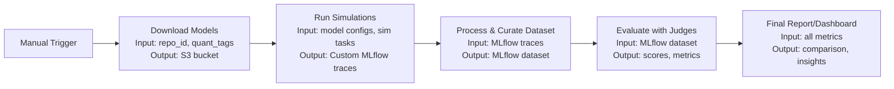

# Beyond Vibes

*LLM evaluation framework for testing both self-hosted, open source models running on llama.cpp and API-based models (OpenAI, Anthropic, etc.).*

This project provides a framework to evaluate models and compare them in latency and quality across real-world engineering tasks. Originally focused on benchmarking local model performance under constrained hardware, it now supports both local and API providers, allowing direct comparison between approaches.


## Methodology

We employ a scientific methodology to benchmark these archetypes. We target specific repositories and define clear success criteria (e.g., a passing test suite, a verified architectural decision). From a high level the process is:



### Stratification (The "Local" Variables)

Unlike API-based benchmarks, local inference is highly sensitive to runtime configuration. We stratify simulations across:

*   **Engine Config**: `llama.cpp` container variants (ROCm, Vulkan, CUDA) and CLI args (batch size, threads, kv-cache type).
*   **Base Models**: Different HuggingFace model families (GLM, Qwen, Mistral).
*   **Quantization**: Impact of precision loss (Q4_K_M vs Q8_0 vs FP16) on reasoning capabilities.

### Simulations

**Current Simulation Tasks:**

*   **Architectural Planning**
    *   Research and architect a login/auth plan for [lighthearted](https://github.com/blake-hamm/lighthearted)
    *   Create a high-level architecture/plan for overnight protein folding in [bhamm-lab](https://github.com/blake-hamm/bhamm-lab)
    *   Migration plan: Ceph CSI vs. Rook Ceph in [bhamm-lab](https://github.com/blake-hamm/bhamm-lab)

*   **Repo Maintenance**
    *   Switch from poetry to `uv` for [lighthearted](https://github.com/blake-hamm/lighthearted)
    *   Setup tests in [kube-ai-stack](https://github.com/blake-hamm/kube-ai-stack)
    *   Write unit tests for [lighthearted](https://github.com/blake-hamm/lighthearted)

*   **Feature Implementation**
    *   Create FastAPI endpoints and decouple from fronted in [lighthearted](https://github.com/blake-hamm/lighthearted)
    *   Implement Lidarr and Readarr in [bhamm-lab](https://github.com/blake-hamm/bhamm-lab)
    *   Implement nvim with nvf in [bhamm-lab](https://github.com/blake-hamm/bhamm-lab)

*   **Comparative Research**
    *   Compare LiteLLM and Kong AI Gateway and provide a recommendation
    *   Compare Arize Phoenix, MLflow, and LangFuse for GenAI observability

### Evals

We leverage **DSPy** to compile LLM Judges that score outputs against quality rubrics. Additionally we used [built in judges from MLFlow](https://mlflow.org/docs/latest/genai/eval-monitor/scorers/llm-judge/predefined/).

#### Archetypes

Our use cases naturally fall into four 'archetypes'. These represent the categories of tasks we leverage local models for, serving as the primary lenses for our qualitative evals.

| Archetype | Description | Primary Goal | Examples |
| :--- | :--- | :--- | :--- |
| **Architectural Planning** | High-level design & research | Feasibility & Clarity | Auth plan, Protein folding architecture |
| **Repo Maintenance** | Refactoring & chores | Stability & Cleanliness | Migrating to `uv`, adding unit tests |
| **Feature Implementation** | New functionality code | Correctness & Integration | Implementing Lidarr/Readarr, nvim config |
| **Comparative Research** | Vendor/Tool Analysis | Accuracy & Decision Support | LiteLLM vs Kong, Observability comparisons |

The evaluation framework has two tiers:

#### 1. Universal Evals
*Baseline health metrics applied to every run regardless of archetype.*

*   **Instruction Adherence (The "Vibe" Check)**
    *   **Sycophancy Score (1-5):** Did the model apologize excessively or agree with a bad premise?
    *   **Refusal Rate:** Did it falsely refuse a safe coding task?
    *   **Efficiency:** Total turns/steps to solve (crucial for slow local inference).
*   **Tool Use Quality**
    *   **Hallucination Rate:** Frequency of non-existent tool calls.
    *   **Schema Adherence:** Frequency of JSON formatting errors.
    *   **Loop Detection:** Did the agent get stuck in a read/list loop?
*   **System Performance**
    *   **Throughput:** Tokens Per Second (TPS) generation.
    *   **Latency:** Time to First Token (TTFT) and Prompt Processing.
    *   **Resource Cost:** Peak VRAM usage and model load time.

#### 2. Category-Specific Evals

*   **A. Architectural Planning (The "Design" Judge)**
    *   **Specificity:** Does the plan cite specific files/APIs, or generic concepts?
    *   **Security:** Checks for hardcoded secrets or insecure defaults.
    *   **Constraints:** Adherence to "local-only" or "no-cost" requirements.

*   **B. Repo Maintenance (The "Janitor" Judge)**
    *   **Determinisim:** Binary Pass/Fail on `uv sync`, `pytest`, or build commands.
    *   **Diff Hygiene:** Penalties for modifying unrelated files or formatting changes.
    *   **Reproducibility:** Consistency of output across multiple runs.

*   **C. Feature Implementation (The "Engineer" Judge)**
    *   **Idiomatic Check:** Code style alignment (logger usage, error patterns).
    *   **Completeness:** Implementation of all functional requirements (not just the "happy path").

*   **D. Comparative Research (The "Analyst" Judge)**
    *   **Citation Grounding:** Verification that compared features actually exist.
    *   **Decisiveness:** Did it provide a clear recommendation vs. a vague "it depends"?
    *   **Structure:** Adherence to requested formats (e.g., tables, pros/cons lists).


#### Helpful commands:
```bash
# To get into a nix-based development environment with python and uv
nix develop

# To create and activate a virtual environment
uv venv
source .venv/bin/activate

# To install dependencies
uv sync --all-extras
```

## CLI - Model Download

Download models from HuggingFace to S3. **Only required for local models** (provider: local).

### Prerequisites

- S3 bucket must exist before running
- Valid HuggingFace model repo
- Models with `provider: local` in `models.yaml`

### Setup

1. **Create `.env` file:**
```bash
S3_BUCKET=your-bucket
S3_ENDPOINT=https://s3.example.com
S3_ACCESS_KEY=your-access-key
S3_SECRET_KEY=your-secret-key
```

2. **Create `models.yaml` config:**

Models can be either **local** (downloaded from HuggingFace) or **API** (remote providers like OpenAI, Anthropic).

**Local models** require `repo_id` for downloading:
```yaml
bucket: your-bucket
models:
  - name: qwen3-0.6B
    repo_id: unsloth/Qwen3-0.6B-GGUF
    provider: local  # default if not specified
    quant_tags: ["Q6_K_XL", "Q8_K_XL"]
```

**API models** don't require downloading:
```yaml
models:
  - name: gpt-4o
    provider: openai
    model_id: gpt-4o  # optional, defaults to name
```

**Full example with mixed providers:**
```yaml
bucket: beyond-vibes
models:
  # Local models - will be downloaded
  - name: qwen3-0.6B
    repo_id: unsloth/Qwen3-0.6B-GGUF
    provider: local
    quant_tags: ["Q6_K_XL", "Q8_K_XL"]

  # API-only models - no download needed
  - name: gpt-4o
    provider: openai
    model_id: gpt-4o

  - name: claude-sonnet
    provider: anthropic
    model_id: claude-sonnet-4-20250514
```

**Configuration fields:**
- `name` (required): Identifier for the model
- `provider`: Provider type (`local` for HF downloads, or any API provider like `openai`, `anthropic`)
- `repo_id`: HuggingFace repository ID (required for `provider: local`)
- `model_id`: Model identifier for the API (optional, defaults to `name`)
- `quant_tags`: Quantization tags for filtering GGUF files (local models only)

### Run

```bash
# Dry run (preview only)
uv run beyond-vibes download --config-path models.yaml --dry-run

# Actual download (skips API models automatically)
uv run beyond-vibes download
```

The download command automatically skips models without a `repo_id` (API models) and only processes local models that need downloading from HuggingFace.

## CLI - Simulations

Run simulations by cloning a repo and executing a prompt via OpenCode.

### Prerequisites

- OpenCode server running (default: http://127.0.0.1:4096)
- MLflow tracking server configured (optional, for logging)
- Model defined in `models.yaml`

### Setup

1. **Create `.env` file (if not already done):**
```bash
MLFLOW_TRACKING_URI=https://mlflow.example.com
```

2. **Ensure `models.yaml` has your model:**
```yaml
bucket: beyond-vibes
models:
  - name: minimax-m2.5-free
    repo_id: opencode/minimax-m2.5-free
    quant_tags: []
```

### Run

```bash
# Run simulation with a specific model
uv run beyond-vibes simulate --task poetry_to_uv --model minimax-m2.5-free

# Run all models from a specific provider
uv run beyond-vibes simulate --task poetry_to_uv --provider openai

# Filter by both model and provider
uv run beyond-vibes simulate --task poetry_to_uv --model gpt-4o --provider openai

# With custom config
uv run beyond-vibes simulate --task poetry_to_uv --model qwen3-0.6B --config-path mymodels.yaml

# With custom prompt variables
uv run beyond-vibes simulate --task auth_plan --model minimax-m2.5-free --prompt-vars '{"requirements": "OAuth2"}'

# With specific quantization for local models
uv run beyond-vibes simulate --task poetry_to_uv --model qwen3-0.6B --quant Q6_K_XL
```

### Options

| Option | Description |
|--------|-------------|
| `--task` | Task name (without .yaml) - required |
| `--model` | Model name from models.yaml (filter by specific model) |
| `--provider` | Filter by provider (e.g., `local`, `openai`, `anthropic`) |
| `--config-path` | Path to models.yaml (default: models.yaml) |
| `--prompt-vars` | JSON dict of variables for prompt templating (default: {}) |
| `--quant` | Quantization tag for local models (uses first if not specified) |

**Note:** You must specify either `--model` or `--provider` (or both). If you specify only `--provider`, all models matching that provider will be run sequentially.
